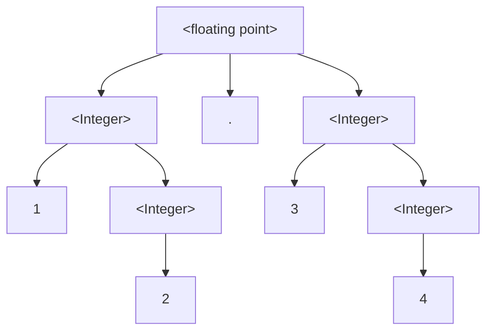

# Let's Talk about the Grammar of a language and its importance 


`Grammar` is a way to represent the structure of a language in a formal way. Be it a programming language or a language such as : `French`, `Spanish`, `Portuguese`...


## Why is Grammar Important?

In the context of programming languages, grammar helps the language designer to clarify and communicate the structure to others. It can also help us deepen our understanding of a language to see how it works and its rules. 


## Let's talk about Symbols 

We have two categories of symbols in a grammar : 

1. **Terminal Symbols** : These are the basic symbols from which strings are formed. They are the actual characters or tokens of the language. For example, in a programming language, terminal symbols could be keywords like `if`, `else`, `while`, operators like `+`, `-`, and literals like numbers and strings.
2. **Non-terminal Symbols** : These are the symbols that are used to represent pieces of the structure of a language. They are placeholders for patterns of terminal symbols and other non-terminal symbols. For example, in a programming language, non-terminal symbols could represent constructs like `expression`, `statement`, or `function`.
3. **Production Rules** : These are the rules that makes up the grammar. They define how terminal and non-terminal symbols can be combined to form valid strings in the language. Each production rule consists of a non-terminal symbol on the left side and a sequence of terminal and/or non-terminal symbols on the right side.Basically, they translae a non-terminal to a sequence of terminal and/or non-terminal. For example, in english grammar: 
- A sentence (non-terminal) can be made up of a noun phrase (non-terminal) followed by a verb phrase (non-terminal).
- A noun phrase (non-terminal) can be made up of a determiner (terminal) followed by a noun (terminal).
- A verb phrase (non-terminal) can be made up of a verb (terminal) followed by a noun phrase (non-terminal).


## How do we represent the Grammar of a language? 

There are several ways to represent the grammar of a language, but one of the most common methods is through `Backus-Naur Form (BNF)` or its variants like `Extended Backus-Naur Form (EBNF)`. These notations use specific symbols to denote terminal and non-terminal symbols, as well as production rules.


In our case, we will be using the Backus Naur Form (BNF) to represent the grammar of our language. But first of all, a little terminology of the BNF notation :
- Terminals are simply written out as they are. For example, the terminal symbol for the keyword `if` is simply written as `if`.
- Non-terminals are usually enclosed in angle brackets `< >` or sometimes written in italics or bold. For example, the non-terminal symbol for an expression could be written as `<expression>`.
- The Production rules are represented using the `::=` symbol. The left side of the `::=` is the non-terminal being defined, and the right side is the sequence of terminal and/or non-terminal symbols that make up the definition. For example, a production rule for an expression could be written as `<sentence> ::= <noun-phrase> <verb-phrase>`. So more generally speaking, we have : `<non-terminal> ::= <sequence of terminal and/or non-terminals >`.
We can use the pipe symbol `|` to denote alternatives in the production rules. For example, a production rule for a noun phrase could be written as `<noun-phrase> ::= <determiner> <noun> | <adjective> <noun>`.


## Example of a simple Grammar in BNF 
An example of a simple grammar that defines integer and floating-point numbers could be represented in BNF as follows:

```bnf
<digit> ::= 0 |1 | 2 | 3 |4 | 5 | 6 | 7| 8| 9
<integer> ::= <digit> | <digit> <integer> 
<floating point> ::= <integer> '.' <integer> 
```

A more complex example could be a c-based programming language grammar :

```bnf
<statement> ::= <if-statement> | <while-statement> | <assignment> | <block> 
<assignment> ::= <variable> '=' <expression> 
<if-statement> ::= if(<condition>) <statement> | if (<condition>) <statement> else <statement> 
<block> ::= { <statement-sequence>} 
<while-statement> ::= while(<condition>) <statement> 
<statement-sequence> ::= <statement> | <statement> <statement-sequence>
```


In these examples, we represented two kind of structure:` lexical structure (like digits, integers, floating points) and syntactical structure (like statements, assignments, if-statements, blocks, etc.)`.
We use separate grammar for handle both, because they deal with different levels of abstraction in the language. Lexical structure focuses on the individual tokens and their formation, while syntactical structure focuses on how those tokens are combined to form valid statements and constructs in the language.

Moreover, combining both lexical and syntactical structure in a single grammar can lead to increased complexity and ambiguity. By separating them, we can simplify the grammar and make it easier to understand and maintain. It also allows for better modularity, as changes to the lexical structure can be made independently of the syntactical structure, and vice versa.
Compiler even handle them separately during the compilation process, with lexical analysis (tokenization) occurring before syntactical analysis (parsing). This separation of concerns helps to streamline the compilation process and improve overall efficiency.


Next , we will talk about parse trees and how to generate them from a given grammar.
`Parse Trees` are a way to visually represent the structure of a language fragment, given a specific grammar. They are tree-like diagrams that show how the different components of a language fragment relate to each other according to the rules defined in the grammar.


